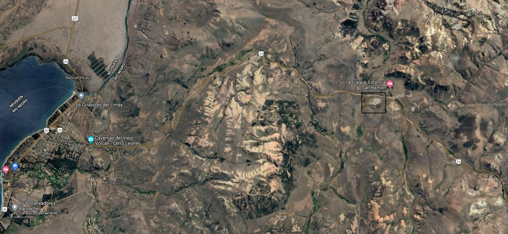
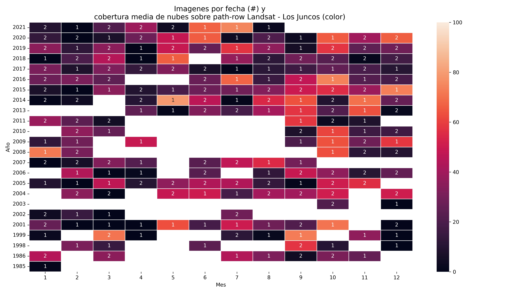
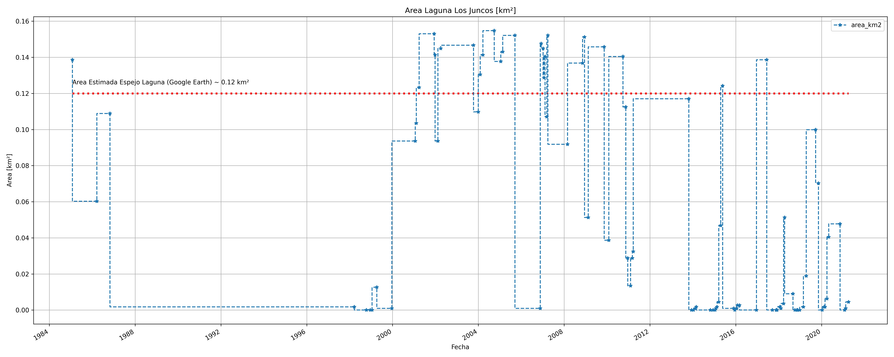
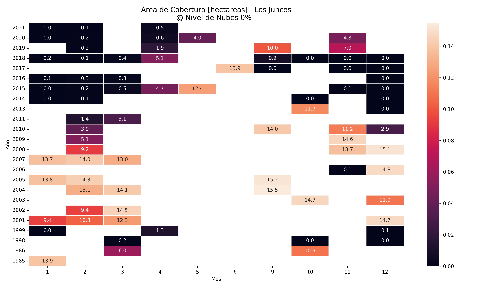

# los-juncos-monitoring

Se monitorea la laguna *Los Juncos* en relacion a su falta de agua e intento de [recuperacion](https://www.bariloche2000.com/noticias/leer/los-amantes-de-las-aves-que-buscan-recuperar-una-laguna-que-ya-no-tiene-agua/134757).

La laguna se encuentra cercana a Dina Huapi (reactangulo negro).

### Años e Imagenes

Se trabajó con un conjunto de imágenes (300) descargadas de Landsat 5 y Landsat 8, correspondientes al periodo 1985-2021.
Sin embargo de este set parecen faltar los años 1988 a 1997.

### Evolución

El analisis detallado y el formato de calculo se lo puede encontrar en [jnb](./Los-Juncos-MOnitoring.ipynb). Aqui
listamos la evolucion del area de cobertura unicamente.

#### Evolución Temporal

Los resultados son en [km²]. La linea de referencia se corresponde a una medicion aproximada del "espejo" de la Laguna utilizando Google Earth.

#### Evolucion Temporal Desglosada en Mes y Años

Evolucion temporal del area (esta vez en hectareas), pero desglosando por año y mes lo que permite cierto ciclado y la disminucion de la cobertura para los ultimos años.

### Ambiente de Desarrollo

Se provee un ambiente básico para la ejecución del mayoria de las funcionalidades 
de las jupyter notebooks. Mencionamos el termino "mayoria" puesto que no se
provee la libreria *eo_forge* (proximamente), la cual es la responsable del
procesado de las imagenes raw (carga de la imagen satelital, recorte, calibración,etc).
Para subsanar esta cuestion se dejan los recortes correspondientes calibrados.
Esta información se encuentra en ./products/images.
Estas contemplan rasters con
- *.TIF: bandas B{1-5} para Landsat5 y bandas B{2-6} para Landsat8
- *_CLOUD.TIF: Mascara de nubes.  

#### Imagenes utilizadas

Se pueden obtener desde landsat*-images.csv.